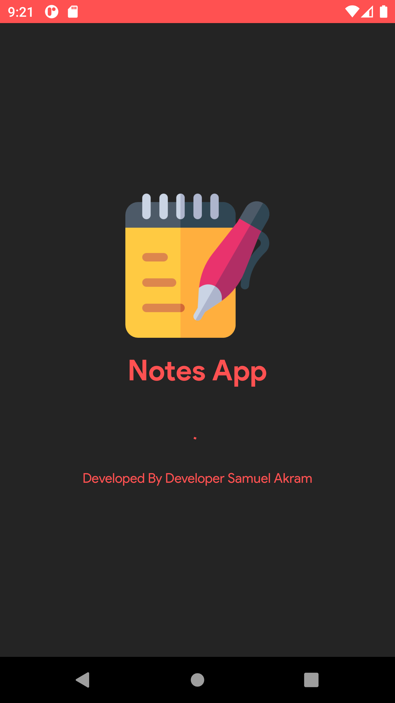

## NOTES TAKING| Kotlin Coroutines | Room, MVVM, Navigation, Databinding | 

This app has.

1. Navigation Component
2. DataBinding
3. Fragments
4. Kotlin coroutines.
5. Room
6. MVVM.
7. Search View 

### Splash Screen
{:height="30px" width="30px"}

### HOME 
{:height="30px" width="30px"}

### Create Note 
{:height="30px" width="30px"}

### Edit Note
{:height="30px" width="30px"}

### Search View
{:height="30px" width="30px"}

